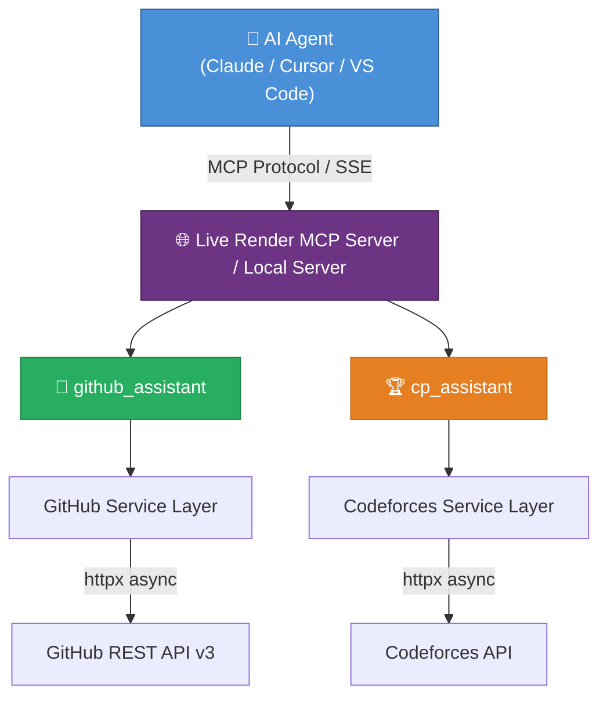

# 🚀 DevAssist MCP Server

**A production-ready Python MCP Server for GitHub & Competitive Programming**


---

> 🌐 **Live Cloud Deployment**: DevAssist MCP Server is deployed and live on **Render.com**!
> - **Base URL & Health Check:** `https://devassist-mcp-server.onrender.com/`
> - **SSE Endpoint:** `https://devassist-mcp-server.onrender.com/sse`
> 
> You can connect your Claude Desktop, Cursor, or VS Code client directly to the hosted Render server without running code locally, or run it locally on your own machine.

---

## 📖 Overview

DevAssist MCP is a **Model Context Protocol (MCP) server** that bridges the gap between AI assistants and developer resources. It exposes two powerful tools — **GitHub Assistant** and **Competitive Programming Assistant** — that any MCP-compatible AI agent (Claude Desktop, Cursor, VS Code Copilot) can use to fetch real-time data.

### ✨ Key Features

| Feature | Description |
|---------|-------------|
| 🌐 **Cloud Deployed** | Live hosting on Render.com with full Server-Sent Events (SSE) support |
| 🐙 **GitHub Integration** | User profiles, repo info, commits, PRs, issues, statistics |
| 🏆 **Codeforces Integration** | Profiles, contest history, rating tracking, submissions |
| 🧠 **Weak Topic Analysis** | AI-powered identification of competitive programming weak areas |
| 💡 **Smart Recommendations** | Personalized problem suggestions based on skill gaps |
| ⚡ **Async Architecture** | Non-blocking I/O with `httpx` for maximum performance |
| 🔒 **Production Ready** | Logging, error handling, type safety, comprehensive tests |

---

## 🏗️ Architecture



---

## 🔌 Connecting to Claude Desktop (`claude_desktop_config.json`)

To use this MCP server in **Claude Desktop**, open or create your `claude_desktop_config.json` file.

### 📍 File Locations:
- **Windows:** `%APPDATA%\Claude\claude_desktop_config.json` *(e.g., `C:\Users\<username>\AppData\Roaming\Claude\claude_desktop_config.json`)*
- **macOS:** `~/Library/Application Support/Claude/claude_desktop_config.json`
- **Linux:** `~/.config/Claude/claude_desktop_config.json`

---

### Option A: Use Live Render Deployment (Recommended)

Connect directly to the cloud-hosted server on **Render.com** using `mcp-remote` bridge:

```json
{
  "mcpServers": {
    "devassist-mcp": {
      "command": "npx",
      "args": [
        "-y",
        "mcp-remote",
        "https://devassist-mcp-server.onrender.com/sse"
      ]
    }
  }
}
```

*Or if your version of Claude Desktop supports native SSE configuration:*

```json
{
  "mcpServers": {
    "devassist-mcp": {
      "url": "https://devassist-mcp-server.onrender.com/sse"
    }
  }
}
```

---

### Option B: Use Local Machine Execution

If you prefer to run the MCP server locally on your own machine:

```json
{
  "mcpServers": {
    "devassist-mcp": {
      "command": "python",
      "args": ["C:/path/to/devassist-mcp/server.py"],
      "env": {
        "GITHUB_TOKEN": "ghp_your_token_here"
      }
    }
  }
}
```

> **Note:** Replace `C:/path/to/devassist-mcp/server.py` with the absolute path to `server.py` on your machine.

---

## 💻 Other IDE Configurations

### Cursor

Add to your Cursor MCP settings (`.cursor/mcp.json`):

**Using Render Cloud Endpoint:**
```json
{
  "mcpServers": {
    "devassist-mcp": {
      "url": "https://devassist-mcp-server.onrender.com/sse"
    }
  }
}
```

**Using Local Python Script:**
```json
{
  "mcpServers": {
    "devassist-mcp": {
      "command": "python",
      "args": ["C:/path/to/devassist-mcp/server.py"],
      "env": {
        "GITHUB_TOKEN": "ghp_your_token_here"
      }
    }
  }
}
```

### VS Code (with Copilot)

Add to your VS Code settings:

```json
{
  "mcp": {
    "servers": {
      "devassist-mcp": {
        "command": "npx",
        "args": [
          "-y",
          "mcp-remote",
          "https://devassist-mcp-server.onrender.com/sse"
        ]
      }
    }
  }
}
```

---

## 📋 Prerequisites & Local Setup

### Prerequisites
- **Python 3.12+**
- **GitHub Personal Access Token** ([Generate here](https://github.com/settings/tokens)) — for higher rate limits
- **pip** or **uv** package manager

### Option 1: Using `uv` (Recommended)

```bash
# Clone the repository
git clone https://github.com/Champion-2006/DevAssist-MCP-Server.git
cd DevAssist-MCP-Server

# Create virtual environment and install dependencies
uv venv
uv pip install -r requirements.txt
```

### Option 2: Using `pip`

```bash
# Clone the repository
git clone https://github.com/Champion-2006/DevAssist-MCP-Server.git
cd DevAssist-MCP-Server

# Create virtual environment
python -m venv venv

# Activate virtual environment
# Windows:
venv\Scripts\activate
# macOS/Linux:
source venv/bin/activate

# Install dependencies
pip install -r requirements.txt
```

---

## ⚙️ Local Configuration

1. Copy the environment template:
   ```bash
   cp .env.example .env
   ```

2. Edit `.env` with your settings:
   ```env
   GITHUB_TOKEN=ghp_your_personal_access_token_here
   LOG_LEVEL=INFO
   TRANSPORT=stdio
   PORT=8000
   ```

> **Note:** The GitHub token is optional but recommended. Without it, requests are limited to 60 API calls/hour. With a token, limit increases to 5,000 requests/hour.

---

## 🚀 Running Local Standalone

### STDIO Mode (Default)
```bash
python server.py
```

### SSE Transport Mode
```bash
python server.py --sse
# or
TRANSPORT=sse PORT=8000 python server.py
```

---

## 🛠️ Tool Documentation

### Tool 1: `github_assistant`

| Action | Description | Requires `repository` |
|--------|-------------|:---------------------:|
| `get_user_profile` | Get GitHub user profile | ❌ |
| `get_user_repos` | List all public repositories owned by a user | ❌ |
| `get_user_activity` | Get recent user activity (commits, PRs, stars) | ❌ |
| `get_repo_info` | Get repository details | ✅ |
| `get_latest_commits` | Get recent commits | ✅ |
| `get_repo_stats` | Get repository statistics | ✅ |
| `get_repo_languages` | Detailed programming language percentage breakdown | ✅ |
| `get_repo_contributors` | Top code contributors to a repository | ✅ |
| `get_latest_release` | Latest release version & release notes | ✅ |
| `get_pull_requests` | Get pull requests | ✅ |
| `get_issues` | Get repository issues | ✅ |

**Example — Get User Profile:**
```
"Show me the GitHub profile of octocat"
```
```json
{
  "login": "octocat",
  "name": "The Octocat",
  "public_repos": 42,
  "followers": 20000,
  "location": "San Francisco"
}
```

**Example — Get Repo Stats:**
```
"What are the stats for octocat/Hello-World?"
```
```json
{
  "repository": "octocat/Hello-World",
  "stars": 2500,
  "forks": 450,
  "language": "Python",
  "open_issues": 12
}
```

---

### Tool 2: `cp_assistant`

| Action | Description |
|--------|-------------|
| `get_user_profile` | Get Codeforces rating and rank |
| `get_contest_history` | Past contest participation |
| `get_recent_submissions` | Recent problem submissions |
| `get_rating_history` | Rating changes over time |
| `analyze_weak_topics` | Identify weak problem areas |
| `recommend_problems` | Personalized problem suggestions |

**Example — Analyze Weak Topics:**
```
"Analyze the weak topics for Codeforces user tourist"
```
```json
[
  {
    "tag": "geometry",
    "total_attempts": 15,
    "successful": 5,
    "failed": 10,
    "success_rate": 33.3
  }
]
```

**Example — Get Recommendations:**
```
"Recommend practice problems for my Codeforces handle"
```
```json
[
  {
    "name": "Theatre Square",
    "rating": 1000,
    "tags": ["math"],
    "url": "https://codeforces.com/problemset/problem/1/A"
  }
]
```

---

## 🧪 Testing

```bash
# Run all tests
pytest tests/ -v

# Run with coverage
pytest tests/ -v --cov=. --cov-report=term-missing

# Run specific test file
pytest tests/test_github_service.py -v

# Run specific test
pytest tests/test_codeforces_service.py::test_analyze_weak_topics -v
```

---

## 📁 Project Structure

```
devassist-mcp/
├── server.py                          # MCP server entry point (STDIO & SSE)
├── config.py                          # Pydantic settings
├── .env.example                       # Environment template
├── requirements.txt                   # Dependencies
├── pyproject.toml                     # Project metadata & tool configs
├── Dockerfile                         # Multi-stage Docker build
├── .dockerignore                      # Docker build exclusions
├── .gitignore                         # Git exclusions
├── README.md                          # Comprehensive documentation
├── tools/
│   ├── github.py                      # GitHub MCP tool
│   └── cp.py                          # Codeforces MCP tool
├── services/
│   ├── github_service.py              # GitHub API client
│   └── codeforces_service.py          # Codeforces API client
├── models/
│   ├── github_models.py               # GitHub Pydantic models
│   └── cp_models.py                   # Codeforces Pydantic models
├── utils/
│   ├── logger.py                      # Structured logging
│   └── exceptions.py                  # Custom exception hierarchy
├── tests/
│   ├── conftest.py                    # Shared test fixtures
│   ├── test_github_service.py         # GitHub service tests
│   ├── test_codeforces_service.py     # Codeforces service tests
│   ├── test_github_tool.py            # GitHub tool tests
│   └── test_cp_tool.py               # Codeforces tool tests
└── logs/                              # Log files (auto-created)
```

---

## 🐳 Deployment Guide

### Render Deployment (Live Production)

This project is deployed live on **Render.com** as a Web Service running in SSE transport mode:

1. **Service Type:** Web Service
2. **Build Command:** `pip install -r requirements.txt`
3. **Start Command:** `python server.py --sse`
4. **Environment Variables:**
   - `TRANSPORT`: `sse`
   - `PORT`: `10000` (or Render default)
   - `GITHUB_TOKEN`: `ghp_your_github_token`
5. **Live URL:** `https://devassist-mcp-server.onrender.com`

---

## 🤝 Contributing

1. Fork the repository
2. Create a feature branch: `git checkout -b feature/amazing-feature`
3. Commit changes: `git commit -m 'Add amazing feature'`
4. Push to branch: `git push origin feature/amazing-feature`
5. Open a Pull Request

### Code Quality

```bash
# Format code
black .

# Lint
ruff check .

# Type check
mypy .
```

---

## 📄 License

This project is licensed under the **MIT License**. See [LICENSE](LICENSE) for details.

---

<div align="center">

**Built with ❤️ using Python, FastMCP, and httpx**

</div>
